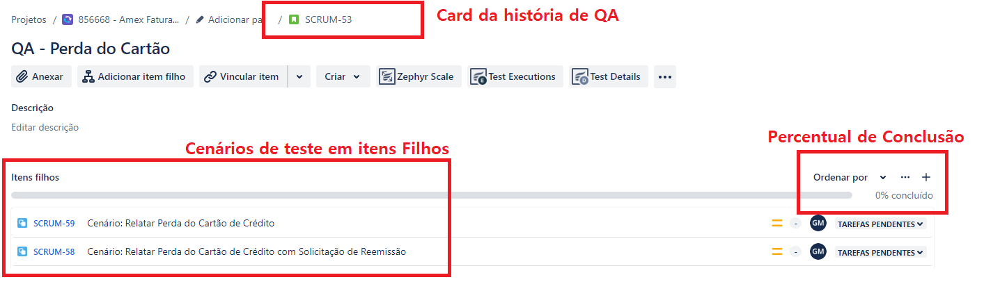
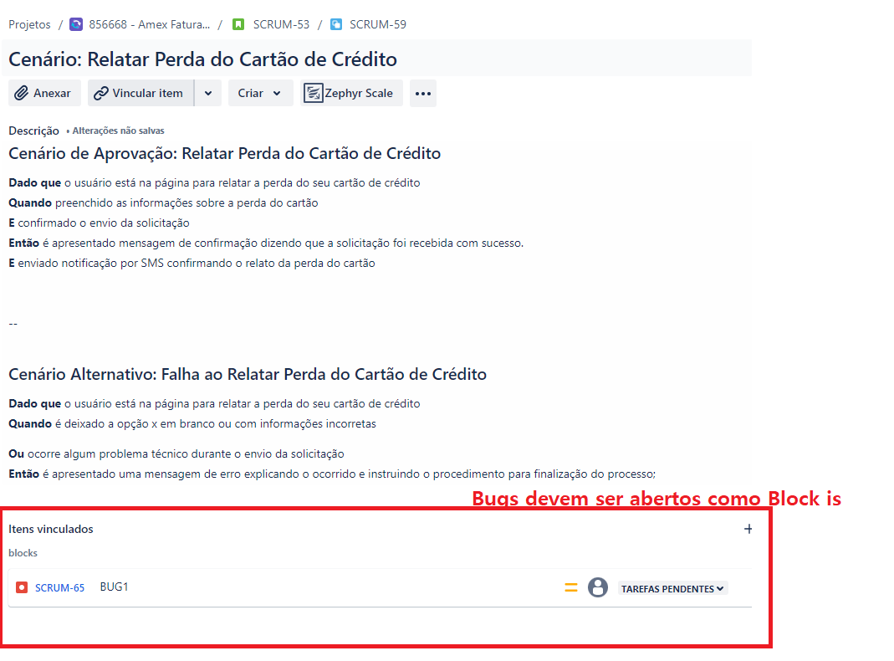
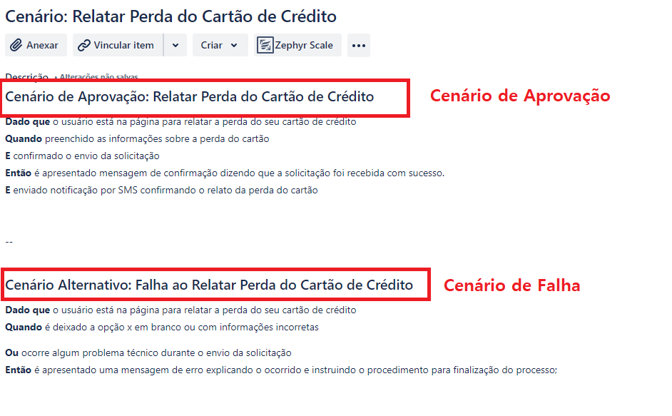

## Link de Apresentação:
- https://www.youtube.com/watch?v=-PEfRoEZWwI

## Documentação
- https://soldevelo.atlassian.net/wiki/spaces/QS/overview

## Modelo de Estrutura no Jira:
-   Card de História da Funcionalidade
-        Card de História para gerenciamento do QA da Funcionalidade
-            Abertura de Itens Filhos com os cenários de Teste (Imprescindível que os cenários de teste contabilizem o % de progresso da história)
-                Cards de Bug vinculado ao item filho;

